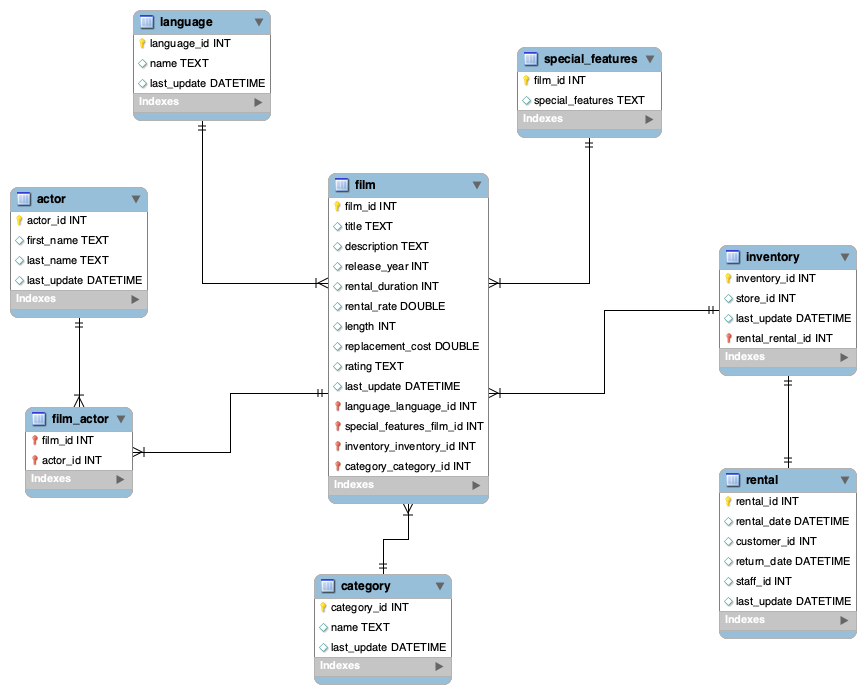

# Proyecto MySQL 🐬

En este proyecto cuento con varios documentos CSV que contienen datos de un antiguo videoclub 🍿

El objetivo ha sido limpiar dichos datos para poder clasificarlos de manera más clara y fácil de interpretar para que su antiguo sueño pueda reconsiderar si debe volver a abrirlo o no

## Proceso 🔎

1. Limpiar los datos de cada CSV
2. Exportar los datos actualizados a nuevos CSVs
3. Creación de la base de datos en MySQL Workbench
4. Establecimiento de las relaciones entre los datos

## Objetivos ✅

1. Calcular la duración promedio de alquiler para películas en cada idioma
2. Calcular la tasa de alquiler promedio para películas en cada idioma
3. Seleccionar los títulos de las películas y sus costos de reemplazo, ordenándolos en orden descendente para encontrar las películas con los costos de reemplazo más altos

